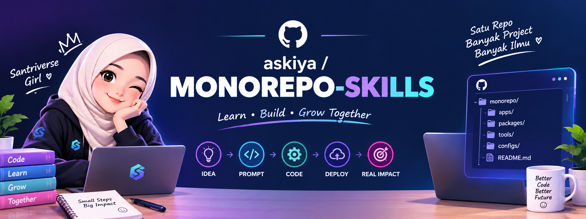

<p align="center">
  
</p>

<h1 align="center">MONOREPO-SKILLS</h1>

<p align="center">
  <strong>Pedoman Vibe Coding Kelas Santriverse</strong><br />
  Dari ide, prompt, dan kode sampai deploy yang menghasilkan dampak nyata.
</p>

<p align="center">
  <a href="START-HERE.md"><strong>👉 MULAI DARI SINI</strong></a> ·
  <a href="paket/"><strong>📦 Pilih Paket</strong></a> ·
  <a href="kelas/latihan/README.md">Latihan Praktik</a> ·
  <a href="examples/toko-produk-digital/">Contoh Project</a> ·
  <a href="templates/">Template</a> ·
  <a href="prompts/README.md">Prompt</a> ·
  <a href="GLOSSARY.md">Kamus Istilah</a> ·
  <a href="BANTUAN.md">Minta Bantuan</a>
</p>

---

Kumpulan pedoman, template, prompt, dan skill untuk membangun produk digital
**dari nol sampai online** dengan cara **vibe coding** (nyuruh AI agent yang ngoding,
kita yang mikir produk, arsitektur, dan review).

Repo ini bukan teori. Ini urutan kerja yang dipakai beneran: pasang AI agent →
tulis dokumen (PRD, SDLC, DESIGN.md) → suruh agent build frontend + backend →
preview di localhost → testing → deploy gratisan → naik ke VPS/cPanel → domain +
pembayaran.

---

## Cara Pakai Repo Ini

1. Buka **[START-HERE.md](START-HERE.md)** — pilih jalur A/B/C/D sesuai target.
2. Copy **[PROGRESS.md](PROGRESS.md)** ke project, lalu centang progres nyata.
3. Kerjakan **[latihan per sesi](kelas/latihan/README.md)** secara urut. Setiap
   sesi punya target, output benar, error umum, dan bukti kelulusan.
4. Lihat **[contoh project terisi](examples/toko-produk-digital/)** sebelum
   mengisi template sendiri.
5. Berhenti di empat **[checkpoint mentor](kelas/CHECKPOINT-MENTOR.md)** untuk
   review dokumen, localhost, staging, dan produksi.
6. Kalau buntu, ikuti **[format minta bantuan](BANTUAN.md)** — jangan hanya
   bilang "error bang".

> Bingung istilah? Buka **[GLOSSARY.md](GLOSSARY.md)**. Bingung pilih hosting?
> Buka **[decision tree hosting](docs/09-deploy-gratis/03-pilih-hosting-decision-tree.md)**.

> Aturan emas kelas ini: **AI agent tidak boleh menebak.** Kalau agent tidak
> punya dokumen, dia akan mengarang arsitektur. Dokumen dulu, kode belakangan.

---

## Peta Isi

| Folder | Isi |
|---|---|
| `docs/00-mulai-dari-sini/` | Filosofi vibe coding, alur besar, prasyarat laptop |
| `docs/01-setup-ai-agent/` | Antigravity (utama), Cursor, Claude Code, Codex, Hermes |
| `docs/02-dokumen-perencanaan/` | PRD, SDLC, DESIGN.md, ARCHITECTURE, TASKS, AGENTS.md |
| `docs/03-tech-stack/` | Pilihan framework & kapan dipakai |
| `docs/04-build-frontend/` | Next.js dari 0 lewat AI agent |
| `docs/05-build-backend/` | API, auth, database, struktur service |
| `docs/06-database/` | PostgreSQL, Prisma, migrasi, seed, backup |
| `docs/07-preview-localhost/` | Menjalankan & debug lokal |
| `docs/08-testing/` | Manual QA, unit test, e2e, gate sebelum deploy |
| `docs/09-deploy-gratis/` | Vercel, Netlify, Cloudflare, Render + perbandingan semua platform |
| `docs/10-deploy-vps/` | VPS, Docker, Coolify, Nginx, SSL, backup |
| `docs/11-hosting-cpanel/` | **Beli hosting → DNS → SSL → upload → Node.js → DB & credential** |
| `docs/12-domain-dns-cloudflare/` | Domain, DNS, SSL, subdomain staging |
| `docs/13-payment/` | Xendit, Lynk.id, webhook, aktivasi otomatis |
| `docs/14-keamanan-secret/` | Secret, hardening app, hardening cPanel, monitoring & insiden |
| `docs/15-troubleshooting/` | Error umum + **decision tree** troubleshooting |
| `docs/16-email-transaksional/` | SMTP, SPF, DKIM, DMARC, email aman |
| `docs/17-upload-object-storage/` | Upload file, R2/S3, signed URL |
| `docs/18-ci-github-actions/` | CI otomatis lint/test/build + branch protection |
| `docs/19-seo-performance-legal/` | SEO, Core Web Vitals, privacy policy, terms |
| `docs/20-operasional-serah-terima/` | Maintenance bulanan, serah terima klien |
| `templates/` | File siap isi (PRD, SDLC, DESIGN.md, dst) |
| `prompts/` | Prompt siap tempel per fase |
| `skills/` | Skill AI agent (format Hermes/Claude) |
| `checklists/` | Checklist rilis, keamanan, performa |
| `kelas/` | Silabus, kuis, checkpoint mentor, latihan per sesi |
| `examples/` | **Project contoh terisi lengkap** (PRD→TASKS→prompt→hasil) |
| `deployment-examples/` | **Config siap pakai** Vercel, cPanel, Docker, Nginx |
| `GLOSSARY.md` | Kamus istilah pemula |
| `PROGRESS.md` | Penanda posisi belajar (copy ke project sendiri) |
| `BANTUAN.md` | Format minta bantuan + checklist sebelum bertanya |
| `START-HERE.md` | **Halaman pertama: pilih jalur, mulai di sini** |
| `paket/` | **📦 11 paket arsitektur berlevel** (A–K) — pilih stack+deploy sesuai level |

---

## Alur Besar (hafalkan ini)

```
IDE PRODUK
   ↓
PRD.md          apa yang dibangun & untuk siapa
   ↓
SDLC.md         tahapan kerja & definisi selesai
   ↓
DESIGN.md       warna, font, spacing, komponen
   ↓
ARCHITECTURE.md folder, stack, kontrak API
   ↓
TASKS.md        pecahan kerja kecil-kecil
   ↓
AI AGENT build  frontend + backend
   ↓
localhost       lihat, pakai, catat bug
   ↓
testing         gate: lint + build + test lolos
   ↓
deploy gratis   biar bisa dilihat orang (staging)
   ↓
VPS / cPanel    produksi + domain sendiri
```

---

## Prinsip Kelas

1. **Dokumen dulu.** Prompt tanpa dokumen = kode sampah yang rapi.
2. **Satu tugas satu commit.** Jangan suruh agent kerjakan 10 hal sekaligus.
3. **Baca diff.** Kalau kamu tidak paham perubahannya, jangan merge.
4. **Secret tidak pernah masuk Git.** Selamanya.
5. **Kalau belum jalan di localhost, jangan deploy.**
6. **Deploy gratisan dulu, VPS belakangan.** Hemat uang, cepat validasi.

---

## Lisensi & Kredit

Materi kelas Santriverse. Bebas dipakai murid kelas untuk project pribadi
maupun klien. Jangan dijual ulang sebagai produk terpisah.
