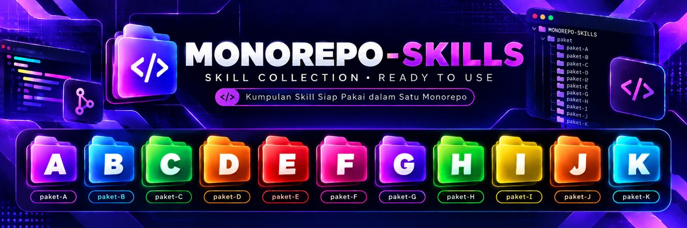

<p align="center">
  
</p>

<h1 align="center">📦 Katalog Paket Arsitektur</h1>
<p align="center"><em>Pilih satu paket sesuai level dan kebutuhan. Setiap paket berisi pedoman lengkap dari perencanaan sampai maintenance.</em></p>

Jangan campur paket. Selesaikan satu dulu.

---

## 🏷️ Badge Level

| Badge | Level | Siapa yang cocok | Syarat |
|---|---|---|---|
| 🟢 | **PEMULA** | Belum pernah coding, baru pertama pakai terminal | Bisa instal aplikasi, punya email |
| 🔵 | **MENENGAH** | Sudah paham terminal, Git, pernah deploy 1× | Pernah bikin project kecil sampai online |
| 🟠 | **LANJUTAN** | Paham Docker, VPS, CI/CD, bisa troubleshoot sendiri | Nyaman baca log server, tidak panik lihat error |
| 🔴 | **EXPERT** | Multi-service, orchestration, infra sendiri | Paham networking, container, monitoring |

> **Jangan sombong pilih level.** Member yang langsung ambil 🔴 tanpa pernah
> deploy sekali pun akan stuck di hari pertama. Naik bertahap lebih cepat
> daripada mengulang dari nol.

---

## 🗺️ Cara Memilih Paket

```text
Kamu mau bikin apa?
│
├── Portfolio / landing page / blog (tanpa login & database)
│     → 🟢 Paket B (Cloudflare Static)
│
├── Web app dengan login + database, mau cepat online
│     ├── Baru pertama kali          → 🟢 Paket A (Vercel Starter)   ← DEFAULT KELAS
│     ├── Mau auth+storage instan    → 🔵 Paket D (Vercel + Supabase)
│     └── Butuh cron/worker/WebSocket→ 🔵 Paket G (Railway Fullstack)
│
├── Klien minta cPanel / sudah punya hosting cPanel
│     → 🟢 Paket C (cPanel Shared)
│
├── Mau kontrol server sendiri
│     ├── Tidak mau ribet Docker     → 🔵 Paket E (VPS Coolify)
│     └── Mau belajar Docker manual  → 🟠 Paket F (VPS Docker Manual)
│
├── Frontend & backend terpisah, tim > 2 orang
│     → 🟠 Paket H (Monorepo Turborepo)
│
├── Production multi-service (cache, queue, reverse proxy)
│     → 🔴 Paket I (Multi-Service Docker)
│
├── Produk AI dengan model lokal / RAG
│     → 🔴 Paket J (Self-hosted AI Stack)
│
└── Stack Santriverse asli (Cloudflare + Coolify + Hermes)
      → 🟠 Paket K (Santriverse Hybrid)
```

---

## 📋 Semua Paket

| | Paket | Level | AI Agent | Frontend | Backend | Database | Deploy | Biaya | Estimasi |
|---|---|---|---|---|---|---|---|---|---|
| 🟢 | **[A — Vercel Starter](paket-A/)** ⭐ | PEMULA | Antigravity | Next.js | Next.js API Routes | Neon PostgreSQL | Vercel | GRATIS | 2 hari |
| 🟢 | **[B — Cloudflare Static](paket-B/)** | PEMULA | Antigravity | Astro / Vite | — | — | Cloudflare Pages | GRATIS | 1 hari |
| 🟢 | **[C — cPanel Shared](paket-C/)** | PEMULA | Antigravity | Next.js export | PHP / Node kecil | MySQL cPanel | cPanel | MURAH | 3 hari |
| 🔵 | **[D — Vercel + Supabase](paket-D/)** | MENENGAH | Cursor | Next.js | Supabase SDK | Supabase PostgreSQL | Vercel | GRATIS→MURAH | 3 hari |
| 🔵 | **[E — VPS Coolify](paket-E/)** | MENENGAH | Antigravity | Next.js standalone | Next.js | PostgreSQL (Coolify) | VPS + Coolify | MENENGAH | 4 hari |
| 🟠 | **[F — VPS Docker Manual](paket-F/)** | LANJUTAN | Claude Code | Next.js | Express / Fastify | PostgreSQL container | Docker + Nginx + Certbot | MENENGAH | 5 hari |
| 🔵 | **[G — Railway Fullstack](paket-G/)** | MENENGAH | Cursor | Next.js | Next.js API Routes | Railway PostgreSQL | Railway | GRATIS→MURAH | 3 hari |
| 🟠 | **[H — Monorepo Turborepo](paket-H/)** | LANJUTAN | Hermes Agent | Next.js (apps/web) | Express (apps/api) | Neon / Supabase | Vercel + Railway | MURAH | 5 hari |
| 🔴 | **[I — Multi-Service Docker](paket-I/)** | EXPERT | Hermes Agent | Next.js | NestJS / Fastify | PostgreSQL + Redis | Docker Compose + Traefik | MENENGAH | 7 hari |
| 🔴 | **[J — Self-hosted AI Stack](paket-J/)** | EXPERT | Hermes Agent | Next.js | FastAPI (Python) | PostgreSQL + pgvector | VPS + Ollama + Coolify | MENENGAH→MAHAL | 7 hari |
| 🟠 | **[K — Santriverse Hybrid](paket-K/)** 🎯 | LANJUTAN | Hermes Agent | Cloudflare Pages | Coolify (VPS) | PostgreSQL (Coolify) | GitHub → Cloudflare + Coolify | MENENGAH | 5 hari |

⭐ = paket default kelas untuk pemula
🎯 = stack yang dipakai Santriverse sekarang

---

## 💰 Kategori Biaya

Harga cepat berubah. Pakai kategori, bukan angka:

| Kategori | Arti | Contoh |
|---|---|---|
| **GRATIS** | free tier cukup untuk belajar dan staging | Vercel Hobby, Cloudflare Pages, Neon free |
| **MURAH** | biaya bulanan kecil, sekali bayar tinggal pakai | shared hosting cPanel, domain |
| **MENENGAH** | biaya bulanan tetap, kapasitas jelas | VPS 2vCPU/4GB, managed DB |
| **MENENGAH→MAHAL** | naik cepat kalau butuh GPU atau traffic besar | VPS GPU, inference model besar |

Yang sering dilupakan: **waktu kamu juga biaya.** VPS "murah" jadi mahal kalau
kamu habis 10 jam sebulan mengurus server.

Cek harga terbaru langsung di situs resmi provider. Jangan percaya angka di
tutorial mana pun (termasuk yang ini).

---

## 🎬 Video Tutorial

Setiap paket punya slot video di README-nya. Kalau slot masih kosong, berarti
video belum direkam — ikuti panduan teks dulu.

---

## 📁 Isi Setiap Paket

```text
paket-X/
├── README.md          overview, stack diagram, kapan pakai, checklist
├── 01-pedoman.md      PRD, SDLC, DESIGN, ARCHITECTURE, TASKS, AGENTS
├── 02-ai-agent.md     setup AI agent sesuai paket
├── 03-build.md        build frontend + backend + database
├── 04-preview.md      localhost, debug, testing
├── 05-deploy.md       deploy sesuai infrastruktur paket
├── 06-domain-ssl.md   domain, DNS, HTTPS
├── 07-maintenance.md  backup, monitoring, update
└── 08-rekomendasi-hosting.md  opsi gratis sampai berbayar
```

> Paket B memakai `06-rekomendasi-hosting.md` karena tidak butuh bab domain dan maintenance terpisah.

---

## ❓ FAQ

**Boleh pindah paket di tengah jalan?**
Boleh, tapi hindari. Pindah paket = ulang deploy dari awal. Kalau memang
salah pilih, pindah **sebelum** fase deploy, bukan sesudah.

**Bisa gabung dua paket?**
Bisa, tapi jangan di project pertama. Paket K contohnya: gabungan Cloudflare
(frontend) + Coolify (backend). Itu untuk yang sudah paham dua-duanya.

**AI agent boleh beda dari yang tertulis?**
Boleh. Paket menyebut agent yang paling cocok, bukan wajib. Antigravity untuk
pemula karena GUI, Hermes/Claude Code untuk yang nyaman CLI.

**Paket mana yang paling cepat online?**
🟢 Paket B (static, 1 hari). Untuk yang butuh database, 🟢 Paket A (2 hari).

**Saya pemula tapi klien minta VPS. Harus pakai Paket F?**
Jangan. Pakai 🔵 Paket E (Coolify) — tetap VPS, tapi tidak perlu hafal
Dockerfile dan Nginx config.

**Butuh berapa lama sampai paham semua paket?**
Tidak perlu paham semua. Kuasai satu sampai produksi, baru lirik yang lain.
Member yang mencoba semua paket sekaligus tidak menyelesaikan satu pun.

---

## 🔗 Hubungan dengan Materi Lain

| Kamu butuh | Buka |
|---|---|
| Belum tahu mulai dari mana | [`../START-HERE.md`](../START-HERE.md) |
| Bingung istilah | [`../GLOSSARY.md`](../GLOSSARY.md) |
| Template dokumen kosong | [`../templates/`](../templates/) |
| Contoh dokumen terisi | [`../examples/toko-produk-digital/`](../examples/toko-produk-digital/) |
| Prompt siap tempel | [`../prompts/README.md`](../prompts/README.md) |
| Latihan per sesi | [`../kelas/latihan/README.md`](../kelas/latihan/README.md) |
| Error saat praktik | [`../docs/15-troubleshooting/02-decision-tree.md`](../docs/15-troubleshooting/02-decision-tree.md) |
| Mau minta bantuan | [`../BANTUAN.md`](../BANTUAN.md) |
| Config siap pakai | [`../deployment-examples/`](../deployment-examples/) |
