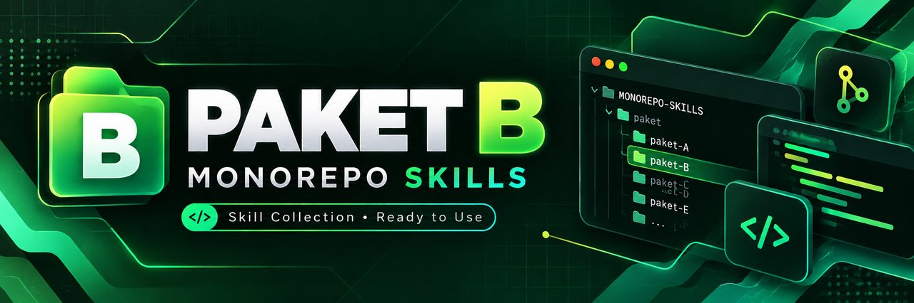

<p align="center">
  
</p>

<h1 align="center">PAKET B — Cloudflare Static</h1>
<p align="center">
  
  
  
</p>
<p align="center"><em>Astro/Vite static — paket tercepat untuk website statis online.</em></p>

---

## 🏗️ Stack Diagram

```text
┌──────────────────────────────┐
│           BROWSER            │
│       HTML + CSS + JS        │
└──────────────┬───────────────┘
               │ HTTPS
┌──────────────▼───────────────┐
│      CLOUDFLARE PAGES         │
│  CDN global + SSL otomatis    │
│                               │
│  Output statis: dist/         │
│  Backend: TIDAK ADA           │
│  Database: TIDAK ADA          │
└──────────────┬───────────────┘
               │ auto-deploy
┌──────────────▼───────────────┐
│          GITHUB              │
│      branch main + PR        │
└──────────────────────────────┘

DNS: Cloudflare → Pages custom domain
```

---

## 🎯 Kapan Pakai Paket Ini

- Portofolio pribadi
- Landing page produk atau jasa
- Company profile sederhana
- Blog statis
- Dokumentasi publik
- Undangan atau halaman acara
- Tidak ada data rahasia dan tidak perlu akun pengguna

## 🎯 Kapan JANGAN Pakai

- Butuh login atau role pengguna
- Butuh database atau data berubah lewat dashboard admin
- Butuh API privat, payment webhook, atau upload file
- Butuh menyimpan secret di server
- Butuh proses server, cron, atau background job

Kalau butuh login/database, gunakan **Paket A — Vercel Starter**.

---

## ⚡ Prasyarat

| Kebutuhan | Cara cek |
|---|---|
| Node.js LTS | `node -v` → minimal 18 |
| npm | `npm -v` |
| Git | `git --version` |
| GitHub | Akun dan repository baru |
| Cloudflare | Akun gratis |
| Antigravity | Lihat [`02-ai-agent.md`](02-ai-agent.md) |
| Domain | Opsional; URL `.pages.dev` sudah gratis |

---

## 🏗️ Pilih Astro atau Vite

| Pilihan | Cocok untuk | Pilih kalau |
|---|---|---|
| **Astro** | Blog, portofolio, dokumentasi | Banyak konten/halaman, perlu SEO kuat |
| **Vite + React** | Landing page interaktif | Banyak interaksi UI, sedikit halaman |

Untuk project pertama, pilih **Astro**. Jangan pasang dua framework sekaligus.

---

## 📚 Alur Lengkap

```text
1. Pedoman ──► 2. AI Agent ──► 3. Build ──► 4. Preview ──► 5. Deploy
   (2 docs)      (setup)        (static)     (Lighthouse)  (Cloudflare Pages)
```

1. Pedoman → 2. AI Agent → 3. Build → 4. Preview → 5. Deploy

> Paket B selesai di fase 5. Domain custom dan SSL ditangani langsung dalam
> panduan deploy Cloudflare Pages. Maintenance ringan: update konten,
> dependency, dan cek hasil build sebelum push.

| Fase | File | Hasil |
|---|---|---|
| 1. Pedoman | [`01-pedoman.md`](01-pedoman.md) | PRD ringan + DESIGN.md |
| 2. AI Agent | [`02-ai-agent.md`](02-ai-agent.md) | Antigravity siap kerja |
| 3. Build | [`03-build.md`](03-build.md) | Website responsive tanpa backend |
| 4. Preview | [`04-preview.md`](04-preview.md) | Build dan Lighthouse lolos |
| 5. Deploy | [`05-deploy.md`](05-deploy.md) | Live di Cloudflare Pages |
| 6. Rekomendasi Hosting | [`06-rekomendasi-hosting.md`](06-rekomendasi-hosting.md) | Opsi static hosting dan domain |

---

## 🎬 Video Tutorial

> 🎬 Video belum tersedia. Akan ditambahkan.

---

## ✅ Checklist Selesai

- [ ] PRD ringan dan DESIGN.md selesai
- [ ] Memilih satu stack: Astro atau Vite
- [ ] Antigravity membaca kedua dokumen
- [ ] Website responsive pada 375px, 768px, dan 1440px
- [ ] Tidak ada backend, API privat, database, atau secret di frontend
- [ ] Semua link dan navigasi bekerja
- [ ] `npm run build` sukses dan menghasilkan folder `dist/`
- [ ] Lighthouse Performance, Accessibility, Best Practices, dan SEO ≥ 90
- [ ] Repository terhubung ke Cloudflare Pages
- [ ] URL `.pages.dev` terbuka dari HP
- [ ] Custom domain aktif dan HTTPS valid (jika memakai domain)

---

## 🔗 Referensi

| Topik | Lokasi |
|---|---|
| Template dokumen | [`../../templates/`](../../templates/) |
| Contoh dokumen terisi | [`../../examples/toko-produk-digital/`](../../examples/toko-produk-digital/) |
| Preview localhost | [`../../docs/07-preview-localhost/`](../../docs/07-preview-localhost/) |
| Testing | [`../../docs/08-testing/`](../../docs/08-testing/) |
| Config Cloudflare Pages | [`../../deployment-examples/cloudflare-pages/`](../../deployment-examples/cloudflare-pages/) |
