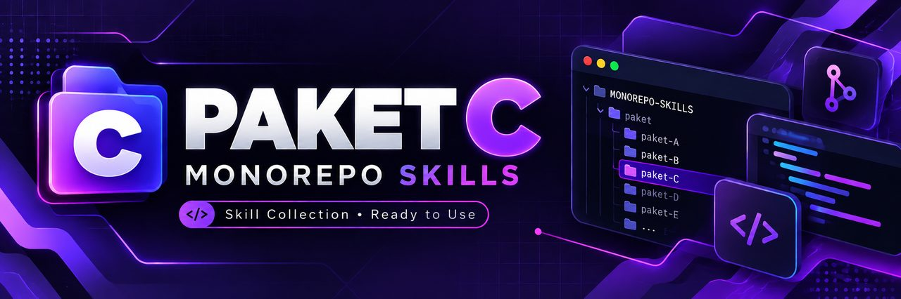

<p align="center">
  
</p>

<h1 align="center">PAKET C — cPanel Shared</h1>
<p align="center">
  
  
  
</p>
<p align="center"><em>Next.js export + PHP + MySQL + cPanel.</em></p>

---

## 🏗️ Stack Diagram

```text
┌──────────────────────────────────────────────┐
│                   BROWSER                    │
│         https://domainmu.com                 │
└──────────────────┬───────────────────────────┘
                   │
         ┌─────────▼──────────┐
         │   cPanel Hosting   │
         │   (Apache / Nginx) │
         ├────────────────────┤
         │  public_html/      │
         │  ├─ index.html     │  ← Next.js static export
         │  ├─ _next/         │
         │  └─ .htaccess      │
         ├────────────────────┤
         │  /home/user/app/   │  ← (opsional) Node.js app via Passenger
         │  └─ server.js      │
         ├────────────────────┤
         │  PHP API endpoint  │  ← /api/contact.php dll
         ├────────────────────┤
         │  MySQL Database    │  ← phpMyAdmin
         ├────────────────────┤
         │  AutoSSL (HTTPS)   │
         └────────────────────┘
```

---

## 🎯 Kapan Pakai Paket Ini

- Klien korporat/UMKM yang **sudah punya hosting cPanel**
- Budget kecil, tidak mau bayar VPS bulanan
- Website company profile, landing page, atau toko sederhana
- Mau pakai MySQL karena hosting sudah menyediakan
- Tim yang familiar dengan FTP / File Manager

## 🎯 Kapan JANGAN Pakai

| Kebutuhan | Kenapa tidak cocok | Paket alternatif |
|---|---|---|
| WebSocket / real-time | cPanel shared tidak support persistent connection | Paket E (VPS Coolify) |
| Background worker / cron berat | Shared hosting membatasi resource | Paket F (VPS Docker) |
| Docker container | cPanel shared tidak ada Docker | Paket E / F |
| SSR Next.js (bukan static) | Perlu Node server persistent | Paket A (Vercel) |
| Auth kompleks (OAuth, JWT refresh) | Terbatas di PHP/Node kecil | Paket D (Supabase) |
| CI/CD otomatis | Upload manual, bukan git push → auto deploy | Paket A / G |

---

## ⚡ Prasyarat

- [ ] Node.js LTS terinstal (`node -v`)
- [ ] Git terinstal (`git --version`)
- [ ] Hosting cPanel aktif (sudah punya atau baru beli)
- [ ] Domain sudah diarahkan ke hosting
- [ ] Akses phpMyAdmin di cPanel
- [ ] Antigravity terinstal

---

## 📚 Alur Lengkap

```text
1. Pedoman          Tulis PRD, SDLC, DESIGN, ARCHITECTURE, TASKS, AGENTS
       ↓
2. AI Agent         Install & setup Antigravity
       ↓
3. Build            Next.js static export + PHP API + MySQL
       ↓
4. Preview          Tes di localhost, pastikan output build benar
       ↓
5. Deploy           Upload ke cPanel File Manager, setup Node.js App (opsional)
       ↓
6. Domain & SSL     DNS di cPanel / Cloudflare, AutoSSL, force HTTPS
       ↓
7. Maintenance      Backup MySQL, cek disk, update file
```

Ikuti urut. Jangan loncat ke deploy sebelum build jalan di localhost.

---

## 🎬 Video Tutorial

> 🎬 _Slot video — belum direkam. Ikuti panduan teks di bawah._

---

## 📚 Pedoman per Fase

| Fase | File | Isi |
|---|---|---|
| 1 | [01-pedoman.md](01-pedoman.md) | Dokumen perencanaan |
| 2 | [02-ai-agent.md](02-ai-agent.md) | Setup Antigravity |
| 3 | [03-build.md](03-build.md) | Next.js export + PHP API + MySQL |
| 4 | [04-preview.md](04-preview.md) | Tes localhost & build output |
| 5 | [05-deploy.md](05-deploy.md) | Upload ke cPanel |
| 6 | [06-domain-ssl.md](06-domain-ssl.md) | DNS + AutoSSL + HTTPS |
| 7 | [07-maintenance.md](07-maintenance.md) | Backup + monitoring |
| 8 | [08-rekomendasi-hosting.md](08-rekomendasi-hosting.md) | Rekomendasi hosting |

---

## 🔗 Referensi yang Dirujuk

| Topik | Lokasi di monorepo |
|---|---|
| Hosting cPanel lengkap | [`docs/11-hosting-cpanel/`](../../docs/11-hosting-cpanel/) (6 bab) |
| Domain & DNS | [`docs/12-domain-dns-cloudflare/`](../../docs/12-domain-dns-cloudflare/) |
| Maintenance | [`docs/20-operasional-serah-terima/`](../../docs/20-operasional-serah-terima/) |
| Contoh config cPanel static | [`deployment-examples/cpanel-static/`](../../deployment-examples/cpanel-static/) |
| Contoh Node.js di cPanel | [`deployment-examples/cpanel-node/`](../../deployment-examples/cpanel-node/) |
| Template dokumen | [`templates/`](../../templates/) |
| Contoh dokumen terisi | [`examples/toko-produk-digital/`](../../examples/toko-produk-digital/) |

---

## ✅ Checklist Selesai Paket C

- [ ] Dokumen perencanaan (PRD, SDLC, DESIGN, ARCHITECTURE, TASKS, AGENTS) selesai
- [ ] Antigravity terinstal dan bisa baca folder project
- [ ] Next.js berhasil build dengan `output: 'export'`
- [ ] Folder `out/` berisi file HTML statis
- [ ] PHP API endpoint berfungsi di localhost (kalau ada)
- [ ] MySQL database dibuat di phpMyAdmin
- [ ] File terupload ke `public_html/` via File Manager
- [ ] Website bisa diakses via domain dengan HTTPS
- [ ] AutoSSL aktif, HTTP redirect ke HTTPS
- [ ] Backup database pertama sudah didownload
