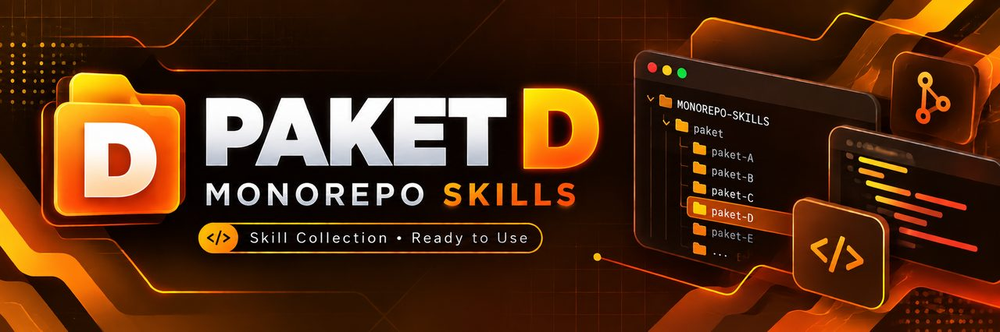

<p align="center">
  
</p>

<h1 align="center">PAKET D — Vercel + Supabase</h1>
<p align="center">
  
  
  
</p>
<p align="center"><em>Next.js + Supabase — auth, storage, dan RLS siap pakai.</em></p>

---

## 🏗️ Stack Diagram

```text
┌───────────────────────────────────────────────────┐
│                    BROWSER                        │
│            https://domainmu.com                   │
└────────────────────┬──────────────────────────────┘
                     │
        ┌────────────▼─────────────┐
        │         VERCEL           │
        │  Next.js (App Router)    │
        │  ├─ Server Components    │
        │  ├─ Server Actions       │
        │  └─ Edge / Serverless    │
        └────────────┬─────────────┘
                     │ Supabase JS SDK
        ┌────────────▼─────────────────────┐
        │          SUPABASE                │
        ├──────────────────────────────────┤
        │  🔐 Auth      email, OAuth, magic│
        │  🗄️  Database PostgreSQL + RLS   │
        │  📦 Storage   file upload, CDN   │
        │  ⚡ Realtime  subscriptions      │
        │  🔧 Edge Fn   Deno functions     │
        └──────────────────────────────────┘
```

---

## 🏗️ Bedanya dengan Paket A (Vercel Starter)

| Aspek | Paket A (Vercel Starter) | Paket D (Vercel + Supabase) |
|---|---|---|
| **Auth** | Setup NextAuth.js manual (provider, session, callback) | ✅ **Sudah built-in** — email, OAuth, magic link |
| **Database** | Neon PostgreSQL + Prisma (setup terpisah) | ✅ **Sudah built-in** — PostgreSQL + SDK |
| **Storage file** | Perlu S3/R2/Cloudinary terpisah | ✅ **Sudah built-in** — Supabase Storage |
| **Authorization** | Logic di kode aplikasi | ✅ **Row Level Security** di level database |
| **Realtime** | Perlu Pusher/Ably/WebSocket | ✅ **Sudah built-in** — Realtime subscriptions |
| **AI Agent** | Antigravity (GUI, untuk pemula) | Cursor (editor-first, lebih cepat) |
| **Waktu setup** | Lebih lama (banyak service terpisah) | Lebih cepat (satu dashboard) |
| **Lock-in** | Rendah (bisa ganti DB provider) | Lebih tinggi (terikat API Supabase) |
| **Level** | 🟢 PEMULA | 🔵 MENENGAH |

**Kesimpulan singkat:** Paket D = Paket A dengan auth + storage + authorization
yang tidak perlu kamu bangun sendiri. Trade-off: lebih terikat ke Supabase.

---

## 🎯 Kapan Pakai Paket Ini

- Butuh **login/register** tapi tidak mau setup auth dari nol
- Butuh **upload file** (avatar, dokumen, gambar produk)
- Butuh **multi-user dengan data terpisah** (RLS menangani ini)
- Butuh fitur **realtime** (chat, notifikasi, live dashboard)
- Sudah pernah deploy minimal 1× (paham Git + Vercel dasar)
- Mau MVP cepat online dengan fitur lengkap

## 🎯 Kapan JANGAN Pakai

| Kebutuhan | Kenapa tidak cocok | Paket alternatif |
|---|---|---|
| Website statis tanpa login | Overkill, Supabase tidak terpakai | Paket B (Cloudflare Static) |
| Belum pernah deploy sama sekali | Konsep RLS + auth flow terlalu banyak sekaligus | Paket A (Vercel Starter) |
| Background worker / cron berat | Vercel serverless punya timeout | Paket G (Railway) atau Paket E (VPS) |
| Butuh kontrol penuh database | Supabase managed, tidak ada akses root | Paket E / F (VPS + PostgreSQL sendiri) |
| Klien minta on-premise | Supabase cloud, bukan on-premise | Paket F (VPS Docker) — atau self-host Supabase |
| Data sensitif yang tidak boleh keluar negeri | Region Supabase terbatas | Paket E / F (VPS di Indonesia) |

---

## ⚡ Prasyarat

- [ ] Node.js LTS terinstal (`node -v`)
- [ ] Git terinstal (`git --version`)
- [ ] Akun GitHub
- [ ] Akun Vercel (bisa login pakai GitHub)
- [ ] Akun Supabase (bisa login pakai GitHub)
- [ ] Cursor terinstal (atau AI agent lain)
- [ ] **Sudah pernah deploy minimal 1×** — ini paket MENENGAH

---

## 📚 Alur Lengkap

```text
1. Pedoman          Tulis PRD, SDLC, DESIGN, ARCHITECTURE, TASKS, AGENTS
       ↓
2. AI Agent         Install & setup Cursor
       ↓
3. Build            Next.js + Supabase SDK + Auth + Storage + RLS
       ↓
4. Preview          localhost + Supabase local dev + testing
       ↓
5. Deploy           Vercel deploy + Supabase hosted + env vars
       ↓
6. Domain & SSL     Cloudflare DNS + Vercel custom domain
       ↓
7. Maintenance      Supabase dashboard + backup + Vercel analytics
```

---

## 🎬 Video Tutorial

> 🎬 _Slot video — belum direkam. Ikuti panduan teks di bawah._

---

## 📚 Pedoman per Fase

| Fase | File | Isi |
|---|---|---|
| 1 | [01-pedoman.md](01-pedoman.md) | Dokumen perencanaan |
| 2 | [02-ai-agent.md](02-ai-agent.md) | Setup Cursor |
| 3 | [03-build.md](03-build.md) | Next.js + Supabase (auth, storage, RLS) |
| 4 | [04-preview.md](04-preview.md) | localhost + Supabase local dev |
| 5 | [05-deploy.md](05-deploy.md) | Vercel + env vars |
| 6 | [06-domain-ssl.md](06-domain-ssl.md) | Cloudflare DNS + Vercel domain |
| 7 | [07-maintenance.md](07-maintenance.md) | Monitoring + backup |
| 8 | [08-rekomendasi-hosting.md](08-rekomendasi-hosting.md) | Rekomendasi hosting |

---

## 🔗 Referensi yang Dirujuk

| Topik | Lokasi di monorepo |
|---|---|
| Setup AI agent | [`docs/01-setup-ai-agent/`](../../docs/01-setup-ai-agent/) |
| Dokumen perencanaan | [`docs/02-dokumen-perencanaan/`](../../docs/02-dokumen-perencanaan/) |
| Build frontend | [`docs/04-build-frontend/`](../../docs/04-build-frontend/) |
| Auth & authorization | [`docs/05-build-backend/02-auth-dan-authorization.md`](../../docs/05-build-backend/02-auth-dan-authorization.md) |
| Database | [`docs/06-database/`](../../docs/06-database/) |
| Preview & debug | [`docs/07-preview-localhost/`](../../docs/07-preview-localhost/) |
| Testing | [`docs/08-testing/`](../../docs/08-testing/) |
| Deploy | [`docs/09-deploy-gratis/01-deploy-staging.md`](../../docs/09-deploy-gratis/01-deploy-staging.md) |
| Domain & DNS | [`docs/12-domain-dns-cloudflare/`](../../docs/12-domain-dns-cloudflare/) |
| Keamanan & secret | [`docs/14-keamanan-secret/`](../../docs/14-keamanan-secret/) |
| Upload & storage | [`docs/17-upload-object-storage/`](../../docs/17-upload-object-storage/) |
| Config Vercel | [`deployment-examples/vercel/`](../../deployment-examples/vercel/) |

---

## ✅ Checklist Selesai Paket D

- [ ] Dokumen perencanaan (PRD, SDLC, DESIGN, ARCHITECTURE, TASKS, AGENTS) selesai
- [ ] Cursor terinstal dan bisa baca folder project
- [ ] Project Supabase dibuat, credential tersimpan di `.env.local`
- [ ] Next.js terhubung ke Supabase (client + server)
- [ ] Auth berfungsi: register, login, logout
- [ ] Row Level Security aktif di semua tabel
- [ ] Storage bucket dibuat, upload file berfungsi
- [ ] Preview localhost berjalan tanpa error
- [ ] Deploy ke Vercel berhasil, env vars terisi
- [ ] Custom domain aktif dengan HTTPS
- [ ] Backup database pertama sudah dibuat
- [ ] `.env.local` ada di `.gitignore` (tidak pernah di-commit)
