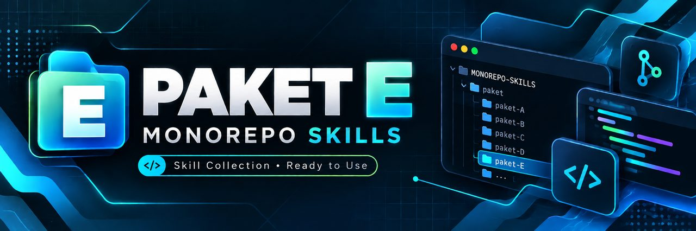

<p align="center">
  
</p>

<h1 align="center">PAKET E — VPS Coolify</h1>
<p align="center">
  
  
  
</p>
<p align="center"><em>Deploy Next.js + PostgreSQL di VPS sendiri lewat panel Coolify, tanpa ribet Nginx manual.</em></p>

---

> 🔵 **MENENGAH** · Estimasi **4 hari** · Biaya **MENENGAH**
>
> **Catatan:** inilah stack yang dipakai Santriverse untuk menjalankan aplikasi di VPS.

## 🎯 Hasil Akhir

Aplikasi Next.js dengan output standalone berjalan di Coolify, memakai PostgreSQL di Coolify, domain Cloudflare, HTTPS valid, dan deploy otomatis dari GitHub.

## 🏗️ Stack

| Bagian | Teknologi |
|---|---|
| Aplikasi | Next.js standalone |
| ORM | Prisma |
| Database | PostgreSQL di Coolify |
| Platform | Coolify di VPS Ubuntu LTS |
| Source | GitHub |
| DNS/proxy | Cloudflare |
| TLS origin | Let's Encrypt dari Coolify |

```text
Pengguna
   │ HTTPS
   ▼
Cloudflare DNS + Proxy
   │ Full (strict)
   ▼
VPS Ubuntu + Coolify
   ├── Application: Next.js standalone :3000
   └── Database: PostgreSQL
          ▲ jaringan internal
          └── Prisma / DATABASE_URL

GitHub ── webhook ──> Coolify ── build + deploy otomatis
```

## 🎯 Kapan Pakai

- Sudah paham terminal, Git, env, dan deploy dasar.
- Butuh kontrol VPS tanpa mengurus Nginx dan container satu per satu.
- Aplikasi memerlukan database persisten, cron, worker, atau resource tetap.
- Siap membayar VPS dan merawat backup serta update server.

## ⚡ Jangan Pakai

- Project hanya landing page statis; Cloudflare Pages lebih ringan.
- Belum pernah deploy dan belum bisa membaca log build.
- Tidak siap menjadi penanggung jawab keamanan dan backup server.
- Memerlukan failover multi-region atau orkestrasi besar.

## 📚 Alur 4 Hari

| Hari | Fokus | Gerbang selesai |
|---|---|---|
| 1 | Pedoman, Antigravity, fondasi app | Dokumen disetujui, app lokal hidup |
| 2 | Prisma, PostgreSQL, fitur inti | Migrasi dan test lulus |
| 3 | VPS, Coolify, database, deploy | URL Coolify sehat |
| 4 | Domain, SSL, backup, monitoring | HTTPS Full (strict), restore diuji |

```text
Rencana → Antigravity → Build → Preview & Test
→ VPS + Coolify → PostgreSQL → Deploy → Domain + SSL → Maintenance
```

## 📚 Urutan Panduan

1. [`01-pedoman.md`](01-pedoman.md) — dokumen dan batas proyek.
2. [`02-ai-agent.md`](02-ai-agent.md) — Antigravity.
3. [`03-build.md`](03-build.md) — Next.js standalone, Prisma, PostgreSQL.
4. [`04-preview.md`](04-preview.md) — localhost dan pengujian.
5. [`05-deploy.md`](05-deploy.md) — VPS, Coolify, resource, auto-deploy.
6. [`06-domain-ssl.md`](06-domain-ssl.md) — Cloudflare dan TLS.
7. [`07-maintenance.md`](07-maintenance.md) — monitoring, backup, update.
8. [`08-rekomendasi-hosting.md`](08-rekomendasi-hosting.md) — rekomendasi hosting dan provider.

## 🎬 Slot Video

> **Video Paket E:** _belum direkam_. Tempel URL video di sini setelah tersedia.

## ✅ Checklist Kelulusan

- [ ] Enam dokumen perencanaan tersedia dan konsisten.
- [ ] `npm run lint`, test, dan `npm run build` lulus.
- [ ] `.next/standalone/server.js` terbentuk.
- [ ] Prisma terhubung ke PostgreSQL tanpa mengekspos database ke internet.
- [ ] Coolify deploy dari GitHub dan auto-deploy aktif.
- [ ] Domain melewati Cloudflare dengan mode Full (strict).
- [ ] Backup PostgreSQL terjadwal dan satu restore uji berhasil.
- [ ] Monitoring CPU, RAM, disk, uptime, dan log aktif.

## 🔗 Rujukan

- [`../../docs/10-deploy-vps/02-coolify.md`](../../docs/10-deploy-vps/02-coolify.md)
- [`../../docs/12-domain-dns-cloudflare/01-domain-dns.md`](../../docs/12-domain-dns-cloudflare/01-domain-dns.md)
- [`../../docs/20-operasional-serah-terima/01-maintenance-bulanan.md`](../../docs/20-operasional-serah-terima/01-maintenance-bulanan.md)
