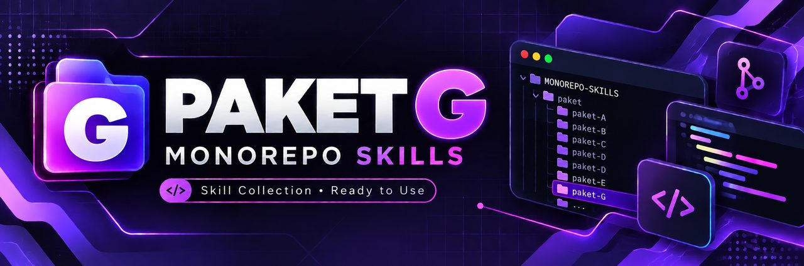

<p align="center">
  
</p>

<h1 align="center">PAKET G — Railway Fullstack</h1>
<p align="center">
  
  
  
</p>
<p align="center"><em>Satu aplikasi Next.js fullstack + PostgreSQL, semuanya di Railway — persistent process untuk cron, worker, dan WebSocket.</em></p>

---

> Cocok kalau aplikasimu butuh proses yang hidup terus: cron, worker, WebSocket.

---

## 🎯 Ringkasan Paket

| Item | Keterangan |
|---|---|
| Level | 🔵 MENENGAH |
| Estimasi waktu | 3 hari (±6 jam/hari) |
| Biaya | GRATIS di awal (trial credit) → MURAH (~$5/bulan Hobby plan) |
| Stack | Next.js (App Router) + Prisma + Railway PostgreSQL |
| Deploy target | Railway (web service + database service) |
| Domain | Custom domain Railway + DNS Cloudflare |
| Prasyarat | Sudah paham Paket A (Next.js + Vercel) atau setara |

---

## 🏗️ Stack Diagram

```
┌───────────────────────────────────────────────────────────┐
│                        PENGGUNA                           │
└───────────────────────────┬───────────────────────────────┘
                            │ HTTPS (app.domainmu.com)
                            ▼
┌───────────────────────────────────────────────────────────┐
│                      CLOUDFLARE DNS                       │
│              CNAME → xxxx.up.railway.app                  │
└───────────────────────────┬───────────────────────────────┘
                            ▼
╔═══════════════════════ RAILWAY PROJECT ═══════════════════╗
║                                                           ║
║  ┌─────────────────────────────┐                          ║
║  │  SERVICE: web               │                          ║
║  │  Next.js (App Router)       │                          ║
║  │  • Halaman & komponen       │                          ║
║  │  • Route Handlers (/api)    │                          ║
║  │  • Prisma Client            │                          ║
║  │  • (opsional) cron/worker   │  ← kelebihan Railway      ║
║  │  Proses Node hidup terus    │                          ║
║  └──────────────┬──────────────┘                          ║
║                 │ DATABASE_URL (private network)          ║
║                 ▼                                         ║
║  ┌─────────────────────────────┐                          ║
║  │  SERVICE: Postgres          │                          ║
║  │  PostgreSQL 16 + volume     │                          ║
║  └─────────────────────────────┘                          ║
║                                                           ║
╚═══════════════════════════════════════════════════════════╝
                            ▲
                            │ auto-deploy on push
┌───────────────────────────┴───────────────────────────────┐
│                      GITHUB REPO                          │
└───────────────────────────────────────────────────────────┘
```

---

## 🎯 Bedanya dengan Paket A (Next.js + Vercel)

Ini bagian paling penting. Jangan pilih Paket G kalau Paket A sudah cukup.

| Aspek | Paket A (Vercel) | Paket G (Railway) |
|---|---|---|
| Model eksekusi | **Serverless** — fungsi bangun saat ada request, lalu mati | **Persistent process** — Node hidup terus |
| Cron / scheduler | Harus pakai Vercel Cron (HTTP trigger) | Bisa `node-cron` di dalam proses, atau Railway Cron service |
| Background worker | Tidak bisa (butuh layanan eksternal) | **Bisa** — service terpisah di project yang sama |
| WebSocket / realtime | Tidak didukung di serverless function | **Didukung** (koneksi socket tetap terbuka) |
| In-memory cache/state | Hilang tiap invocation | Bertahan selama proses hidup |
| Database | Harus eksternal (Neon/Supabase) | **Bawaan Railway**, satu project, private network |
| Cold start | Ada | Tidak ada (proses selalu jalan) |
| Free tier | Generous & permanen untuk hobi | Trial credit, habis → ~$5/bulan |
| Kecepatan edge/CDN global | Sangat kuat | Standar (single region) |

**Intinya:** Railway mendukung **persistent process**. Itu yang membuka pintu untuk
cron internal, worker antrian, dan WebSocket — tiga hal yang tidak bisa dikerjakan
serverless Vercel tanpa layanan tambahan.

---

## 🎯 Kapan Pakai Paket G

✅ Pakai kalau:
- Butuh **cron job** di dalam aplikasi (kirim email harian, sinkron data tiap jam).
- Butuh **background worker** (proses upload besar, generate PDF, kirim WhatsApp batch).
- Butuh **WebSocket / realtime** (chat, notifikasi live, dashboard live).
- Mau **database dan aplikasi satu tempat** supaya billing & jaringan simpel.
- Mau **koneksi database persisten** tanpa pusing connection pooling serverless.

## ⚡ Kapan JANGAN Pakai Paket G

❌ Jangan pakai kalau:
- Aplikasimu hanya CRUD + halaman biasa → **pakai Paket A**, lebih murah & cepat.
- Traffic-mu kecil tapi mau gratis selamanya → Paket A.
- Butuh performa edge global (pengguna tersebar banyak negara) → Paket A.
- Belum pernah deploy apa pun → kerjakan Paket A dulu, baru ke sini.
- Tidak punya kartu / cara bayar $5/bulan → trial Railway akan habis.

---

## 📚 Alur Kerja (3 Hari)

```
HARI 1  ── Perencanaan & Agent
│  01-pedoman.md   → PRD, SDLC, DESIGN, ARCHITECTURE, TASKS, AGENTS.md
│  02-ai-agent.md  → pasang & konfigurasi Cursor
│
HARI 2  ── Build & Preview
│  03-build.md     → Next.js + Prisma + PostgreSQL (target deploy Railway)
│  04-preview.md   → jalankan localhost, testing manual & otomatis
│
HARI 3  ── Deploy & Operasional
│  05-deploy.md      → Railway project, GitHub, PostgreSQL, env vars
│  06-domain-ssl.md  → custom domain Railway + Cloudflare DNS
│  07-maintenance.md → logs, metrics, backup, monitoring biaya
```

---

## 📚 Isi Paket

| File | Isi |
|---|---|
| [01-pedoman.md](01-pedoman.md) | Dokumen perencanaan sebelum ngoding |
| [02-ai-agent.md](02-ai-agent.md) | Setup Cursor sebagai AI agent |
| [03-build.md](03-build.md) | Build Next.js + Prisma + PostgreSQL |
| [04-preview.md](04-preview.md) | Preview localhost & testing |
| [05-deploy.md](05-deploy.md) | Deploy ke Railway |
| [06-domain-ssl.md](06-domain-ssl.md) | Custom domain + SSL via Cloudflare |
| [07-maintenance.md](07-maintenance.md) | Logs, metrics, backup, biaya |
| [08-rekomendasi-hosting.md](08-rekomendasi-hosting.md) | Rekomendasi hosting dan provider |

---

## 🎬 Video Panduan

<!-- VIDEO SLOT: paket-G-overview -->
> 🎬 **Video 1 — Kenalan Paket G & Bedanya dengan Vercel** _(coming soon)_
> Durasi target: 8 menit

<!-- VIDEO SLOT: paket-G-build -->
> 🎬 **Video 2 — Build Next.js + Prisma dari Nol** _(coming soon)_
> Durasi target: 25 menit

<!-- VIDEO SLOT: paket-G-deploy -->
> 🎬 **Video 3 — Deploy ke Railway + PostgreSQL** _(coming soon)_
> Durasi target: 18 menit

<!-- VIDEO SLOT: paket-G-domain -->
> 🎬 **Video 4 — Custom Domain & Cloudflare DNS** _(coming soon)_
> Durasi target: 10 menit

---

## ✅ Checklist Kelulusan Paket G

Centang hanya kalau sudah benar-benar jalan, bukan "kayaknya jalan".

**Hari 1 — Perencanaan**
- [ ] PRD selesai, fitur MVP maksimal 5
- [ ] ARCHITECTURE.md menyebut Railway sebagai deploy target
- [ ] Alasan pakai Railway (persistent process) tertulis eksplisit
- [ ] AGENTS.md sudah ada di root repo
- [ ] Cursor terpasang dan sudah baca dokumen project

**Hari 2 — Build & Preview**
- [ ] `npm run dev` jalan tanpa error di `http://localhost:3000`
- [ ] Prisma schema selesai, `npx prisma migrate dev` sukses
- [ ] Minimal 1 halaman list + 1 form create jalan (data masuk DB)
- [ ] `npm run build` sukses tanpa error TypeScript
- [ ] Health check `/api/health` balas `200`

**Hari 3 — Deploy**
- [ ] Railway project dibuat, repo GitHub tersambung
- [ ] Service PostgreSQL aktif, `DATABASE_URL` terpasang
- [ ] Migrasi produksi jalan (`prisma migrate deploy`)
- [ ] URL `*.up.railway.app` bisa diakses publik
- [ ] Custom domain aktif, SSL hijau (HTTPS)
- [ ] Log deploy terakhir bersih (tidak ada crash loop)
- [ ] Backup database sudah dicoba minimal 1x (`pg_dump` berhasil)
- [ ] Alarm/estimasi biaya bulanan sudah dicatat

**Bukti kelulusan yang dikirim ke mentor:**
1. Link aplikasi produksi (domain sendiri).
2. Screenshot Railway dashboard (2 service: web + Postgres).
3. Screenshot log deploy sukses.
4. File `.sql` hasil backup (nama file saja, jangan isi datanya).

---

## 💰 Perkiraan Biaya

| Komponen | Biaya |
|---|---|
| Railway trial credit | $5 gratis (sekali) |
| Railway Hobby plan | $5/bulan (termasuk $5 usage) |
| Web service (Next.js kecil) | ~$2–4/bulan |
| PostgreSQL service | ~$1–3/bulan |
| Domain `.com` | ~Rp180.000/tahun |
| Cloudflare DNS | GRATIS |
| **Total realistis** | **~$5–7/bulan + domain** |

> ⚠️ Railway menagih berdasarkan **pemakaian** (RAM × waktu + CPU + egress).
> Proses yang hidup terus artinya jam pemakaian penuh. Baca
> [07-maintenance.md](07-maintenance.md) untuk cara menekan biaya.

---

➡️ Mulai dari **[01-pedoman.md](01-pedoman.md)**.
