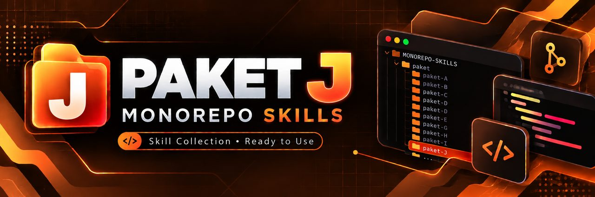

<p align="center">
  
</p>

<h1 align="center">PAKET J — Self-hosted AI Stack</h1>
<p align="center">
  
  
  
</p>
<p align="center"><em>Produk AI dengan model, RAG, dan data vektor yang berjalan di infrastruktur sendiri.</em></p>

---

Paket produk AI yang menjalankan frontend, API Python, penyimpanan vektor, dan model lokal dalam infrastruktur sendiri. GPU opsional; CPU cukup untuk lab dan model kecil, tetapi lebih lambat.

## 🏗️ Stack

Next.js + FastAPI (Python) + PostgreSQL + pgvector + Ollama/vLLM + Docker Compose + Coolify.

## 🏗️ Diagram Stack

```text
Pengguna
   │ HTTPS
   ▼
Frontend Next.js ──HTTP/SSE──► FastAPI
                                 ├── metadata + vector ─► PostgreSQL + pgvector
                                 ├── embedding/chat ────► Ollama
                                 │                        atau vLLM
                                 └── retrieval pipeline:
                                     ingest → chunk → embed → simpan
                                     query → embed → cari → prompt → jawaban

Deploy: Coolify mengelola resource Docker Compose di VPS CPU/GPU
```

## 🎯 Kapan Pakai

- Data/model perlu berada di infrastruktur sendiri.
- Produk membutuhkan RAG atas dokumen privat.
- Tim mampu mengevaluasi kualitas, keamanan prompt, dan operasi model.
- Volume inferensi cukup stabil sehingga self-hosting masuk akal.

## 🎯 Kapan Jangan Pakai

- MVP perlu online cepat dan API model terkelola sudah memadai.
- Tidak ada dataset evaluasi, pemilik operasi, atau rencana kapasitas.
- Membutuhkan model besar tetapi tidak punya anggaran GPU.
- Menganggap RAG otomatis menghilangkan halusinasi.

## ⚡ Prasyarat

- Python, TypeScript, Docker, PostgreSQL, HTTP streaming, dan Linux.
- VPS minimal 8 GB RAM untuk lab CPU; sesuaikan dengan ukuran model/context.
- GPU opsional dengan driver dan Container Toolkit kompatibel.
- Dokumen uji yang sah digunakan, tanpa data rahasia untuk eksperimen publik.

## 📚 Alur 7 Hari

| Hari | Fokus | Bukti selesai |
|---|---|---|
| 1 | PRD AI, model, RAG, evaluasi | acceptance set dan arsitektur disetujui |
| 2 | Hermes Agent | task dan konteks terisolasi |
| 3 | FastAPI, Next.js, pgvector, Ollama | ingest dan ask bekerja |
| 4 | Preview dan evaluasi retrieval | test API dan recall lulus |
| 5 | VPS/Coolify dan model pull | layanan sehat dalam resource limit |
| 6 | Domain frontend/API dan TLS | dua hostname HTTPS valid |
| 7 | update model, backup, GPU/cost | restore dan alarm lulus |

## 📚 Urutan Panduan

1. [`01-pedoman.md`](01-pedoman.md) — PRD AI, model, dan RAG.
2. [`02-ai-agent.md`](02-ai-agent.md) — Hermes Agent untuk stack advanced.
3. [`03-build.md`](03-build.md) — FastAPI, Next.js, pgvector, Ollama, RAG.
4. [`04-preview.md`](04-preview.md) — Compose lokal, API AI, retrieval.
5. [`05-deploy.md`](05-deploy.md) — VPS, Coolify, resource, model pull.
6. [`06-domain-ssl.md`](06-domain-ssl.md) — domain frontend dan API.
7. [`07-maintenance.md`](07-maintenance.md) — model, DB vektor, GPU, backup, biaya.
8. [`08-rekomendasi-hosting.md`](08-rekomendasi-hosting.md) — rekomendasi hosting dan provider.

## 🎬 Video Tutorial

> Slot video mentor: **belum tersedia**. Gunakan panduan teks dan simpan hasil evaluasi.

## 🎯 Batas Paket

Pipeline dibuat sederhana: parsing teks, chunking, embedding, similarity search, prompt ber-sitasi. Tidak mencakup fine-tuning, agent otonom, multimodal, distributed inference, atau jaminan jawaban benar.

## ✅ Checklist Selesai

- [ ] PRD mendefinisikan model, lisensi, bahasa, latency, biaya, dan evaluasi.
- [ ] Pipeline ingest serta retrieval punya dataset uji.
- [ ] FastAPI dan Next.js tidak mengakses DB dengan kredensial publik.
- [ ] Extension pgvector aktif dan indeks terukur.
- [ ] Model Ollama/vLLM dipin dan dapat dimuat ulang.
- [ ] API menampilkan sumber dan menolak jawaban tanpa bukti cukup.
- [ ] HTTPS frontend dan API valid.
- [ ] Backup DB serta dokumen sumber dapat dipulihkan.
- [ ] Monitor CPU/RAM/GPU/disk dan anggaran aktif.
